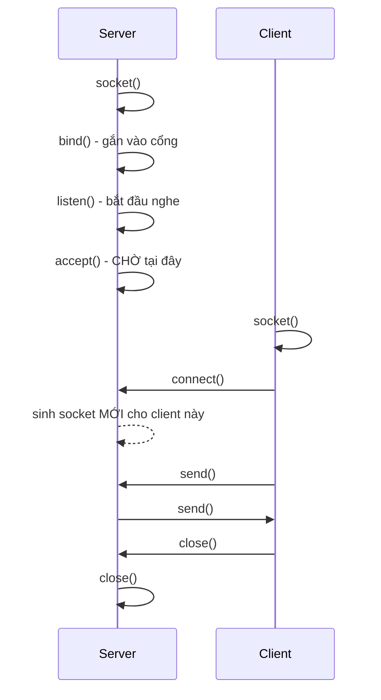
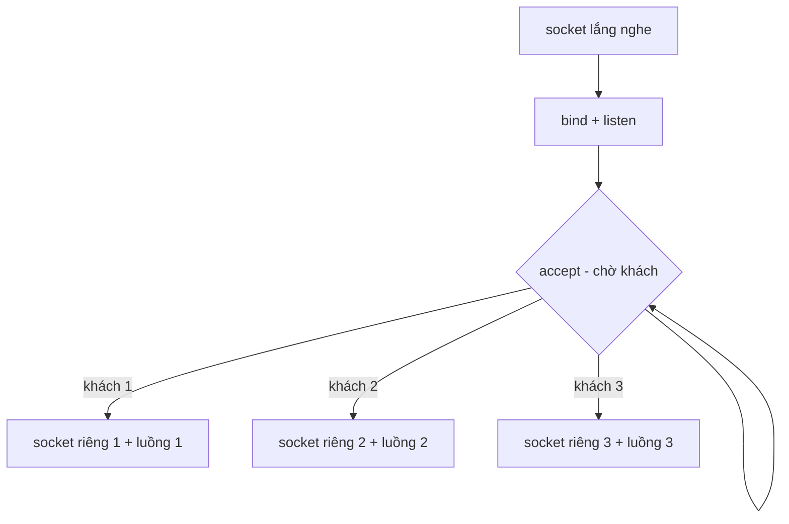
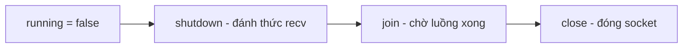

# Lập trình Socket đa nền tảng: Windows & Linux

2026-09-18 · @Someone

Hướng dẫn thực hành cho người mới: viết một chương trình mạng bằng C++ chạy được trên cả Windows lẫn Linux từ cùng một file mã nguồn.

## 1. Tổng quan: socket là gì?

**Socket** là "ổ cắm" mà hai chương trình dùng để nói chuyện qua mạng. Với hệ điều hành, nó chỉ là một con số: *file descriptor* trên Linux, *handle* trên Windows.

Một bên **lắng nghe và chờ** (server), bên kia **chủ động gọi tới** (client). Giống quán cà phê: quán mở cửa ở địa chỉ cố định và đợi, khách tự tìm đến.

Điểm người mới hay nhầm: server có **hai loại socket khác nhau**.

- Socket *lắng nghe*: chỉ làm mỗi việc đón kết nối mới, không bao giờ dùng để gửi tin nhắn.
- Mỗi lần có khách tới, `accept()` sinh ra một socket *mới riêng biệt* cho đúng người khách đó. Mọi việc gửi/nhận với khách ấy diễn ra trên socket mới này.

### TCP hay UDP?

| Đặc điểm | TCP (`SOCK_STREAM`) | UDP (`SOCK_DGRAM`) |
| --- | --- | --- |
| Đảm bảo đến nơi | Có, tự gửi lại nếu mất | Không |
| Đúng thứ tự | Có | Không |
| Ranh giới tin nhắn | **Không có** (luồng byte) | Có (từng gói riêng) |
| Hợp với | Chat, web, truyền file | Game realtime, video call, DNS |

Tài liệu này tập trung vào **TCP** — lựa chọn mặc định đúng cho hầu hết dự án. Hãy nhớ kỹ ô **"không có ranh giới tin nhắn"**: đó là nguồn gốc của cái bẫy lớn nhất với người mới (mục 6).

### Thứ tự các lời gọi hàm



`accept()` và `recv()` là các hàm **blocking**: chương trình dừng lại nằm chờ tại đó cho tới khi có việc xảy ra. Đây chính là lý do cần đa luồng (mục 7) khi muốn phục vụ nhiều người cùng lúc.

## 2. Windows và Linux khác nhau ở đâu?

Tin tốt: **tên và thứ tự các hàm gần như giống hệt nhau** — `socket`, `bind`, `listen`, `accept`, `connect`, `send`, `recv` đều có ở cả hai. Khác biệt nằm ở phần vỏ bọc xung quanh.

| Vấn đề | Linux (POSIX) | Windows (Winsock) |
| --- | --- | --- |
| Header | `<sys/socket.h>`, `<netinet/in.h>`, `<arpa/inet.h>`, `<unistd.h>` | `<winsock2.h>`, `<ws2tcpip.h>` |
| Khởi tạo thư viện | Không cần | `WSAStartup()` **bắt buộc** trước mọi hàm socket |
| Dọn dẹp | Không cần | `WSACleanup()` |
| Kiểu socket | `int` | `SOCKET` (số **không dấu**) |
| Đóng socket | `close()` | `closesocket()` |
| Giá trị lỗi khi tạo | `-1` | `INVALID_SOCKET` |
| Lỗi của hàm khác | `-1` | `SOCKET_ERROR` |
| Đọc mã lỗi | `errno`, `strerror()` | `WSAGetLastError()` |
| Kiểu độ dài địa chỉ | `socklen_t` | `int` |
| Tham số `send`/`recv` | `void*`, `size_t` | `char*`, `int` |
| Thư viện khi link | không cần | `ws2_32.lib` |

### Ba khác biệt dễ làm bạn mất thời gian nhất

1. **Quên `WSAStartup()`** trên Windows: mọi hàm socket sẽ thất bại, thường báo lỗi khó hiểu. Đây là lỗi số một của người mới chuyển code từ Linux sang.
2. **`SOCKET` trên Windows là số KHÔNG DẤU.** Vì vậy `if (sock < 0)` — cách kiểm tra lỗi quen thuộc trên Linux — **luôn sai** trên Windows. Hãy luôn so sánh với `INVALID_SOCKET`.
3. **Mã lỗi nằm ở nơi khác.** Trên Windows, `errno` và `perror()` *không* phản ánh lỗi socket; phải gọi `WSAGetLastError()`.

### Một điểm cần lưu ý về `errno`

Trên Linux, hãy đọc `errno` **ngay lập tức** sau lời gọi thất bại. Bất kỳ hàm nào gọi xen vào giữa (kể cả `printf`) cũng có thể ghi đè nó.

Ngoài ra `strerror()` không an toàn luồng — trong chương trình đa luồng hãy dùng `strerror_r()`. Đây là cùng một loại bẫy với `inet_ntoa()` và `localtime()` ở mục 7.

## 3. Khung code đa nền tảng

Dán khối này vào đầu mỗi dự án mạng. Nó che đi toàn bộ khác biệt ở mục 2, để phần code còn lại viết một lần chạy cả hai nơi.

```cpp
#ifdef WINDOWS_BUILD
    #include <winsock2.h>
    #include <ws2tcpip.h>
    #pragma comment(lib, "ws2_32.lib")   // chỉ MSVC hiểu; MinGW dùng -lws2_32
    using socklen_t = int;
#else
    #include <sys/socket.h>
    #include <netinet/in.h>
    #include <arpa/inet.h>
    #include <unistd.h>
    using SOCKET = int;
    constexpr SOCKET INVALID_SOCKET = -1;
    constexpr int    SOCKET_ERROR   = -1;
#endif

// Khởi tạo / dọn dẹp thư viện (Windows cần, Linux không)
inline bool initSockets() {
#ifdef WINDOWS_BUILD
    WSADATA wsa;
    return WSAStartup(MAKEWORD(2, 2), &wsa) == 0;
#else
    return true;
#endif
}

inline void cleanupSockets() {
#ifdef WINDOWS_BUILD
    WSACleanup();
#endif
}

// Đóng socket
inline void closeSocket(SOCKET s) {
#ifdef WINDOWS_BUILD
    closesocket(s);
#else
    ::close(s);
#endif
}

// Đánh thức một recv() đang bị chặn ở luồng khác (xem mục 8)
inline void shutdownSocket(SOCKET s) {
#ifdef WINDOWS_BUILD
    shutdown(s, SD_BOTH);
#else
    ::shutdown(s, SHUT_RDWR);
#endif
}

// Lấy mã lỗi socket gần nhất
inline int lastSocketError() {
#ifdef WINDOWS_BUILD
    return WSAGetLastError();
#else
    return errno;
#endif
}
```

### Cảnh báo: đừng bao giờ viết `#define close closesocket`

Đây là mẹo bạn sẽ gặp trong rất nhiều tutorial cũ trên mạng, và nó là một cái bẫy thật sự:

```cpp
#define close closesocket   // ❌ ĐỪNG
```

`#define` là **thay thế văn bản mù quáng**. Nó đổi *mọi* chữ `close` phía dưới trong file — kể cả `file.close()` của `std::ifstream`, `stream.close()`, hay hàm thành viên `close()` của bất kỳ lớp nào. Chương trình đang chạy tốt sẽ đột nhiên không biên dịch được ngay khi bạn thêm một thư viện mới, với thông báo lỗi hoàn toàn không liên quan tới socket.

Hàm `closeSocket()` ở trên làm đúng việc đó nhưng có kiểm tra kiểu và không đụng tới cái gì khác.

### Vì sao dùng `using` và `constexpr` thay vì `typedef` và `#define`

- `using SOCKET = int` đọc xuôi hơn `typedef int SOCKET`, và là cách được khuyến nghị từ C++11.
- `constexpr SOCKET INVALID_SOCKET = -1` tạo hằng số **có kiểu**, tuân theo phạm vi, được trình biên dịch kiểm tra. Còn `#define` thì không có kiểu và có thể vô tình thay thế trúng tên khác trong thư viện.

Cả hai đều được tính sẵn lúc biên dịch nên không hề chậm hơn.

## 4. Phía Server từng bước

```cpp
constexpr unsigned short PORT = 8080;
constexpr int BACKLOG = 10;

// 1. Tạo socket lắng nghe
const SOCKET serverSocket = socket(AF_INET, SOCK_STREAM, 0);
if (serverSocket == INVALID_SOCKET) { /* lỗi */ }

// 2. Cho phép dùng lại cổng ngay sau khi tắt server
int opt = 1;
setsockopt(serverSocket, SOL_SOCKET, SO_REUSEADDR,
           reinterpret_cast<const char*>(&opt), sizeof(opt));

// 3. Mô tả địa chỉ sẽ lắng nghe
sockaddr_in addr{};              // {} xóa toàn bộ struct về 0 — đừng bỏ qua
addr.sin_family      = AF_INET;
addr.sin_port        = htons(PORT);
addr.sin_addr.s_addr = INADDR_ANY;

// 4. Gắn socket vào cổng đó
if (::bind(serverSocket, reinterpret_cast<sockaddr*>(&addr),
           sizeof(addr)) == SOCKET_ERROR) { /* lỗi */ }

// 5. Bắt đầu lắng nghe
if (listen(serverSocket, BACKLOG) == SOCKET_ERROR) { /* lỗi */ }

// 6. Vòng lặp đón khách
while (true) {
    sockaddr_in clientAddr{};
    socklen_t len = sizeof(clientAddr);
    const SOCKET clientSocket = accept(serverSocket,
            reinterpret_cast<sockaddr*>(&clientAddr), &len);
    if (clientSocket == INVALID_SOCKET) continue;   // lỗi 1 khách, đừng sập server

    std::thread(handleClient, clientSocket, clientAddr).detach();
}
```

### Giải thích những chỗ dễ vướng

**`htons(PORT)` — bắt buộc.** Các máy lưu số nguyên theo thứ tự byte khác nhau. `htons` ("host to network short") đổi số cổng sang thứ tự byte chuẩn mạng. Quên gọi thì cổng 8080 có thể thành 36895.

**`INADDR_ANY`** nghĩa là "lắng nghe trên *mọi* địa chỉ IP của máy này" — cả `127.0.0.1` lẫn IP mạng LAN. Nếu chỉ muốn nhận kết nối từ chính máy mình, dùng `inet_pton` với `"127.0.0.1"` thay thế.

**`::bind` có dấu `::`.** Trong C++ có `std::bind` (ở `<functional>`) là một hàm hoàn toàn khác. Dấu `::` bảo trình biên dịch "lấy hàm `bind` của hệ thống". Nếu bạn viết `using namespace std;` thì thiếu dấu `::` sẽ gây lỗi biên dịch rất khó hiểu.

**`SO_REUSEADDR` — đừng bỏ qua.** Sau khi tắt server, TCP giữ cổng ở trạng thái `TIME_WAIT` khoảng 1–2 phút. Không bật tùy chọn này, chạy lại server ngay sẽ báo "Address already in use" và bạn sẽ ngồi chờ vô cớ.

**`backlog`** là độ dài hàng đợi các kết nối đang chờ được `accept()`. Khi server bận, khách mới xếp hàng ở đây; vượt quá thì bị từ chối. Giá trị 10 đủ cho dự án học tập.

**`sockaddr_in addr{}`** — cặp ngoặc nhọn đặt toàn bộ struct về 0. Bỏ qua bước này là lỗi tiềm ẩn kinh điển: các trường không gán (như `sin_zero`) sẽ chứa rác từ ngăn xếp.

### Luồng dữ liệu của server



## 5. Phía Client từng bước

Client đơn giản hơn server: không `bind`, không `listen`, không `accept` — chỉ tạo socket rồi gọi tới.

```cpp
constexpr unsigned short PORT = 8080;
constexpr const char* SERVER_IP = "127.0.0.1";

// 1. Tạo socket
SOCKET clientSocket = socket(AF_INET, SOCK_STREAM, 0);
if (clientSocket == INVALID_SOCKET) { /* lỗi */ }

// 2. Mô tả địa chỉ server cần kết nối tới
sockaddr_in addr{};
addr.sin_family = AF_INET;
addr.sin_port   = htons(PORT);
if (inet_pton(AF_INET, SERVER_IP, &addr.sin_addr) <= 0) {
    std::cerr << "Địa chỉ IP không hợp lệ: " << SERVER_IP << '\n';
    closeSocket(clientSocket);
    return 1;
}

// 3. Kết nối
if (connect(clientSocket, reinterpret_cast<sockaddr*>(&addr),
            sizeof(addr)) == SOCKET_ERROR) {
    std::cerr << "Không kết nối được tới server\n";
    closeSocket(clientSocket);
    return 1;
}

// 4. Giờ đã có thể send() / recv()
```

### Những chỗ dễ vướng

**Dùng `inet_pton`, không dùng `inet_addr`.** `inet_addr()` là hàm cũ, không phân biệt được địa chỉ hợp lệ `255.255.255.255` với giá trị báo lỗi của nó. `inet_pton` trả về rõ ràng: `1` = thành công, `0` = chuỗi sai định dạng, `-1` = lỗi khác.

**Đừng dùng `perror()` để báo lỗi `inet_pton`.** `perror` in mô tả của `errno`, nhưng `inet_pton` **không đặt `errno`** khi chuỗi sai định dạng — nó chỉ trả về `0`. Kết quả là bạn thường thấy thông báo vô nghĩa kiểu `"Invalid address: Success"`. Hãy tự in thông báo như ví dụ trên.

**`127.0.0.1` chỉ chạy trong cùng một máy.** Đó là địa chỉ loopback. Muốn client ở máy khác kết nối tới, thay bằng IP thật của máy chạy server trong mạng LAN (ví dụ `192.168.1.10`), và nhớ mở cổng trên tường lửa.

**`connect()` có thể treo khá lâu.** Nếu server không tồn tại, lời gọi này nằm chờ tới khi hệ điều hành hết kiên nhẫn — có thể hàng chục giây. Với chương trình học tập thì chấp nhận được; muốn giới hạn thời gian chờ, bạn cần socket chế độ non-blocking kèm `select()` (xem mục 12).

### Mẹo kiểm tra nhanh mà không cần viết client

Trong lúc phát triển server, bạn có thể thử bằng công cụ có sẵn:

```bash
# Linux / macOS
nc 127.0.0.1 8080            # gõ gì đó rồi Enter để gửi

# Windows PowerShell
Test-NetConnection 127.0.0.1 -Port 8080
```

Cách này giúp tách bạch lỗi: nếu `nc` kết nối được mà client của bạn thì không, vấn đề nằm ở client chứ không phải server.

## 6. Gửi/nhận và framing — cái bẫy lớn nhất

**Đây là mục quan trọng nhất của tài liệu này.** Gần như mọi dự án chat của người mới đều mắc lỗi ở đây, và nó chỉ lộ ra khi chạy thật.

### Vấn đề: TCP không có ranh giới tin nhắn

Rất dễ tưởng rằng một lần `send()` bên này tương ứng một lần `recv()` bên kia. **Điều đó sai.** TCP là một *luồng byte* liên tục, không phải luồng *tin nhắn*. Hệ điều hành được phép:

- **Gộp** nhiều lần `send()` liên tiếp thành một lần `recv()` duy nhất, và
- **Chia** một lần `send()` lớn thành nhiều lần `recv()` nhỏ.

Server gửi hai tin cách nhau vài micro-giây:

```cpp
send(sock, "[SUCCESS] Đăng nhập thành công!", ...);
send(sock, "[SYSTEM] Gõ /help để xem lệnh", ...);
```

Client rất có thể nhận được **cả hai dính liền trong một lần `recv()`**:

```
[SUCCESS] Đăng nhập thành công![SYSTEM] Gõ /help để xem lệnh
```

Code kiểu `std::string msg(buffer);` rồi đem so sánh hay hiển thị sẽ hỏng ngay. Lỗi này **không xuất hiện khi test thủ công chậm rãi** — chỉ khi hai tin được gửi sát nhau, nên rất dễ lọt qua giai đoạn phát triển.

### Giải pháp 1: dấu phân cách (đơn giản, hợp cho chat văn bản)

Quy ước mỗi tin nhắn kết thúc bằng `\n`. **Bên gửi** luôn thêm vào:

```cpp
void sendMessage(SOCKET s, const std::string& msg) {
    const std::string framed = msg + "\n";
    sendAll(s, framed);          // xem sendAll bên dưới
}
```

**Bên nhận** gom vào một bộ đệm tích lũy rồi tự tách:

```cpp
std::array<char, 4096> buffer{};
std::string recvBuffer;                    // tồn tại NGOÀI vòng lặp

while (running) {
    const int n = recv(sock, buffer.data(),
                       static_cast<int>(buffer.size()), 0);
    if (n <= 0) break;                     // 0 = đối phương đóng, <0 = lỗi

    recvBuffer.append(buffer.data(), static_cast<size_t>(n));
    //  ^ append với ĐỘ DÀI TƯỜNG MINH, không dùng std::string(buffer)

    std::size_t pos;
    while ((pos = recvBuffer.find('\n')) != std::string::npos) {
        const std::string msg = recvBuffer.substr(0, pos);
        recvBuffer.erase(0, pos + 1);
        xuLyTinNhan(msg);                  // xử lý HẾT tin trọn vẹn đang có
    }
    // phần dư còn lại trong recvBuffer là tin chưa nhận đủ — chờ vòng sau
}
```

Hạn chế: nội dung tin nhắn không được chứa `\n`. Với chat một dòng thì ổn.

### Giải pháp 2: tiền tố độ dài (đúng cho dữ liệu bất kỳ)

Gửi 4 byte độ dài trước, rồi mới tới nội dung. Cách này chịu được cả dữ liệu nhị phân, file, ảnh:

```cpp
// Gửi
uint32_t len = htonl(static_cast<uint32_t>(msg.size()));
sendAll(s, reinterpret_cast<const char*>(&len), 4);
sendAll(s, msg.data(), msg.size());

// Nhận: đọc đủ 4 byte độ dài → đọc đủ len byte nội dung
```

Luôn bọc độ dài bằng `htonl`/`ntohl` để hai máy khác kiến trúc hiểu giống nhau. Và **luôn giới hạn `len`** (ví dụ tối đa 10 MB) trước khi cấp phát — nếu không, một client xấu gửi `len = 4 tỷ` sẽ làm server cạn bộ nhớ.

### Bẫy đi kèm: `send()` có thể gửi thiếu

`send()` trả về **số byte thực sự gửi được**, và con số đó có thể **nhỏ hơn** những gì bạn yêu cầu, đặc biệt với tin nhắn lớn. Bỏ qua giá trị trả về là mất dữ liệu âm thầm. Luôn dùng vòng lặp:

```cpp
bool sendAll(SOCKET s, const char* data, size_t len) {
    size_t sent = 0;
    while (sent < len) {
        const int n = send(s, data + sent,
                           static_cast<int>(len - sent), 0);
        if (n <= 0) return false;          // mất kết nối
        sent += static_cast<size_t>(n);
    }
    return true;
}
```

### Hai lỗi nhỏ nhưng nguy hiểm khi nhận

| Cách viết | Vấn đề |
| --- | --- |
| `std::string msg(buffer);` | Dừng ở byte `\0` đầu tiên. Nếu `recv` lấp đầy trọn vùng đệm mà không còn byte 0, nó **đọc tràn ra ngoài mảng** — hành vi không xác định. |
| `if (n == 0) { /* bỏ qua */ }` | `recv` trả `0` nghĩa là đối phương **đã đóng kết nối**. Không xử lý sẽ thành vòng lặp vô tận ngốn 100% CPU. |

Luôn dùng `recvBuffer.append(buffer.data(), n)` với độ dài tường minh, và luôn kiểm tra `n <= 0`.

## 7. Đa luồng và an toàn luồng

Vì `accept()` và `recv()` đều là hàm blocking, mô hình phổ biến nhất cho dự án học tập là **mỗi client một luồng**.

### Bảo vệ dữ liệu dùng chung

Mọi biến mà nhiều luồng cùng đọc/ghi đều phải có khóa. Quy tắc quan trọng: **khóa chỉ có tác dụng khi MỌI bên truy cập đều dùng nó.** Một bên đọc có khóa còn bên ghi quên khóa thì vẫn là data race.

```cpp
std::vector<Client> clients;
std::mutex clientsMutex;

void broadcast(const std::string& msg, SOCKET sender) {
    std::lock_guard<std::mutex> lock(clientsMutex);
    for (const auto& c : clients) {
        if (c.socket != sender) sendMessage(c.socket, msg);
    }
}
```

`std::lock_guard` khóa lúc tạo và **tự mở khóa** khi ra khỏi phạm vi — kể cả khi hàm thoát giữa chừng vì ngoại lệ. Đừng tự gọi `lock()`/`unlock()` thủ công.

### Gộp kiểm tra và sửa đổi thành một thao tác

Đây là lỗi rất dễ mắc. Đoạn code sau **có race** dù cả hai hàm đều có khóa bên trong:

```cpp
if (!userExists(user)) {        // khóa rồi mở
    users[user] = {...};        // khóa lại — có KHE HỞ ở giữa
}
```

Giữa hai lời gọi, một luồng khác có thể chen vào và cũng thấy "chưa tồn tại". Phải giữ **một khóa duy nhất xuyên suốt**:

```cpp
bool registerUser(const std::string& name, const std::string& hash) {
    std::lock_guard<std::mutex> lock(usersMutex);
    auto [it, inserted] = users.try_emplace(name, User{name, hash});
    return inserted;            // false = tên đã tồn tại
}
```

### Các hàm KHÔNG an toàn luồng — phải tránh

Đây là nhóm hàm cũ trả về con trỏ tới **vùng đệm tĩnh dùng chung**. Hai luồng gọi cùng lúc sẽ ghi đè kết quả của nhau. Chúng chạy có vẻ đúng khi test một mình, rồi hỏng ngẫu nhiên khi có nhiều người dùng.

| Đừng dùng | Hãy dùng | Ghi chú |
| --- | --- | --- |
| `inet_ntoa()` | `inet_ntop()` | Ghi vào vùng đệm của bạn; hỗ trợ cả IPv6 |
| `localtime()` | `localtime_r()` / `localtime_s()` | POSIX / Windows |
| `gmtime()` | `gmtime_r()` / `gmtime_s()` |  |
| `strerror()` | `strerror_r()` | Windows: `strerror_s()` |
| `gethostbyname()` | `getaddrinfo()` | Bản cũ đã lỗi thời, không hỗ trợ IPv6 |

Ví dụ thay thế `inet_ntoa`:

```cpp
std::string ipToString(const sockaddr_in& addr) {
    std::array<char, INET_ADDRSTRLEN> ip{};
    if (inet_ntop(AF_INET, &addr.sin_addr, ip.data(), ip.size()) == nullptr)
        return "unknown";
    return ip.data();
}
```

Lưu ý `localtime_s` có thứ tự tham số khác nhau giữa các trình biên dịch:

```cpp
std::tm tmBuf{};
#ifdef WINDOWS_BUILD
    localtime_s(&tmBuf, &now);      // MSVC và MinGW: (tm*, time_t*)
#else
    localtime_r(&now, &tmBuf);      // POSIX: (time_t*, tm*)
#endif
```

### Bản thân `send`/`recv` thì sao?

Gọi `send()` từ nhiều luồng **trên cùng một socket** có thể làm hai tin nhắn trộn lẫn vào nhau. Hãy để mỗi socket chỉ có một luồng gửi, hoặc bọc lời gọi gửi bằng một mutex riêng cho socket đó.

## 8. Đóng kết nối đúng cách

### `shutdown()` khác `close()` thế nào?

|  | Tác dụng |
| --- | --- |
| `shutdown(s, SHUT_RDWR)` | Đóng **kênh liên lạc**: báo cho bên kia biết, và làm mọi `recv()` đang chờ trên socket đó trả về `0` ngay lập tức. Số hiệu socket vẫn còn. |
| `close(s)` | Trả **số hiệu socket** lại cho hệ điều hành. Sau lời gọi này, con số đó có thể được cấp lại cho thứ khác bất cứ lúc nào. |

### Vấn đề: đóng socket khi luồng khác còn đang dùng

Đây là lỗi rất phổ biến và rất khó tìm. Kịch bản quen thuộc:

```cpp
std::thread(receiveMessages).detach();   // luồng này nằm chờ trong recv()
// ... người dùng gõ /quit ...
closeSocket(clientSocket);               // ❌ luồng kia CÒN ĐANG dùng socket này
```

Đây là **hành vi không xác định**. Nguy hiểm hơn: ngay khi `close()` trả số hiệu về cho hệ điều hành, số đó có thể được cấp lại cho một file hoặc kết nối **hoàn toàn khác** — và luồng kia vô tình đọc/ghi nhầm tài nguyên đó.

Lỗi này thường không lộ ra khi test thông thường. Công cụ **ThreadSanitizer** phát hiện được nó (mục 11).

### Trình tự dọn dẹp đúng

Mấu chốt: **đừng `detach()`** luồng dùng chung socket. Giữ nó ở dạng join được, rồi dọn dẹp theo đúng 4 bước:

```cpp
std::thread receiveThread(receiveMessages);   // KHÔNG detach

// ... chương trình chạy ...

// Dọn dẹp:
running = false;                       // 1. báo luồng kia biết sắp dừng
shutdownSocket(clientSocket);          // 2. đánh thức recv() đang bị chặn
if (receiveThread.joinable())
    receiveThread.join();              // 3. CHỜ luồng kết thúc hẳn
closeSocket(clientSocket);             // 4. giờ mới an toàn để đóng
```

Bước 2 là chìa khóa: nếu chỉ đặt `running = false` thôi thì chưa đủ — luồng kia vẫn đang **nằm chờ bên trong `recv()`** và không có cơ hội kiểm tra biến cờ. `shutdown()` khiến `recv()` trả về `0` ngay, luồng thoát vòng lặp và kết thúc.



### Xử lý Ctrl+C an toàn

Signal handler trên Linux **chỉ được gọi một danh sách hàm rất hạn chế** (async-signal-safe). `printf`, `std::cout`, `exit()`, cấp phát bộ nhớ đều **không** nằm trong danh sách — gọi chúng có thể gây kẹt nếu tín hiệu ập đến đúng lúc luồng khác đang giữ khóa nội bộ của thư viện.

```cpp
extern "C" void signalHandler(int) {
    running = false;
    const char msg[] = "\n[*] Đã ngắt kết nối.\n";
    const ssize_t ignored = write(STDOUT_FILENO, msg, sizeof(msg) - 1);
    (void)ignored;
    _exit(0);        // _exit, KHÔNG phải exit
}

// Đăng ký bằng sigaction, không dùng signal()
struct sigaction sa{};
sa.sa_handler = signalHandler;
sigemptyset(&sa.sa_mask);
sa.sa_flags = 0;
sigaction(SIGINT, &sa, nullptr);
```

Dùng `sigaction()` thay `signal()`: hàm `signal()` cũ có hành vi **khác nhau giữa các hệ điều hành** (có nơi tự gỡ handler sau lần đầu kích hoạt). Trên Windows, cơ chế tương ứng là `SetConsoleCtrlHandler()`.

## 9. Checklist bẫy thường gặp

Tra nhanh khi chương trình chạy sai.

| Triệu chứng | Nguyên nhân thường gặp | Cách sửa |
| --- | --- | --- |
| Mọi hàm socket thất bại trên Windows | Quên `WSAStartup()` | Gọi `initSockets()` đầu `main` |
| `if (sock < 0)` không bắt được lỗi trên Windows | `SOCKET` là số không dấu | So sánh với `INVALID_SOCKET` |
| "Address already in use" khi chạy lại server | Cổng còn ở `TIME_WAIT` | Bật `SO_REUSEADDR` trước `bind` |
| Hai tin nhắn dính liền, tin bị cắt cụt | Không có framing | Thêm `\n` hoặc tiền tố độ dài (mục 6) |
| Tin nhắn dài bị mất một phần | Bỏ qua giá trị trả về của `send` | Dùng `sendAll()` có vòng lặp |
| Chương trình ngốn 100% CPU | Không xử lý `recv` trả về `0` | Thoát vòng lặp khi `n <= 0` |
| Lỗi biên dịch lạ ở `file.close()` | `#define close closesocket` | Xóa macro, dùng `closeSocket()` |
| Cổng thành số lạ (8080 → 36895) | Quên `htons()` | Luôn bọc số cổng bằng `htons` |
| Giờ hoặc IP hiển thị sai ngẫu nhiên | `localtime()` / `inet_ntoa()` | Dùng bản `_r` / `_s`, `inet_ntop` (mục 7) |
| Crash ngẫu nhiên khi nhiều người dùng | Thiếu mutex, hoặc chỉ khóa một bên | Mọi bên truy cập đều phải khóa |
| Crash khi thoát chương trình | `close()` khi luồng khác còn dùng | `shutdown` → `join` → `close` (mục 8) |
| Đăng ký trùng tên vẫn lọt | Kiểm tra và ghi tách rời | Gộp trong một khóa (mục 7) |
| `"Invalid address: Success"` | Dùng `perror` cho `inet_pton` | Tự in thông báo lỗi |
| Client ở máy khác không kết nối được | Dùng `127.0.0.1` hoặc bị tường lửa chặn | Dùng IP LAN thật, mở cổng |

### Ba thói quen phòng bệnh

1. **Luôn kiểm tra giá trị trả về.** `send`, `recv`, `bind`, `listen`, `accept`, `connect`, `ioctl`, `getline` — tất cả đều có thể thất bại. Bỏ qua chúng là nguồn gốc của phần lớn lỗi khó tìm.
2. **Đừng tin vào một lần `recv` là một tin nhắn.** Quy tắc này đáng nhắc lại vì nó phản trực giác nhất.
3. **Test với nhiều client cùng lúc ngay từ sớm.** Lỗi đa luồng hầu như không bao giờ lộ ra khi chỉ có một người dùng.

## 10. Biên dịch và build

### Lệnh trực tiếp

```bash
# Linux / macOS
g++ -std=c++20 -Wall -Wextra -pthread server.cpp -o server

# Windows — MSVC (Developer Command Prompt)
cl /std:c++20 /W4 /DWINDOWS_BUILD server.cpp ws2_32.lib

# Windows — MinGW
g++ -std=c++20 -Wall -Wextra -DWINDOWS_BUILD server.cpp -o server.exe -lws2_32
```

Ba điểm cần nhớ:

- `-pthread` trên Linux là **bắt buộc** khi dùng `std::thread`. Thiếu nó, chương trình có thể biên dịch được nhưng crash lúc chạy.
- `-DWINDOWS_BUILD` chính là thứ bật nhánh `#ifdef` ở mục 3.
- `ws2_32` là thư viện socket của Windows. MSVC có thể tự link qua `#pragma comment(lib, ...)`, nhưng MinGW thì **không hiểu pragma đó** — phải truyền `-lws2_32`.

### CMakeLists.txt đa nền tảng

Dùng CMake thì không phải nhớ các lệnh trên, và tự xử lý khác biệt giữa hai hệ điều hành:

```cmake
cmake_minimum_required(VERSION 3.15)
project(MessengerApp CXX)

set(CMAKE_CXX_STANDARD 20)
set(CMAKE_CXX_STANDARD_REQUIRED ON)

add_executable(server server.cpp)
add_executable(client client.cpp)

foreach(target server client)
    if(WIN32)
        target_compile_definitions(${target} PRIVATE WINDOWS_BUILD)
        target_link_libraries(${target} PRIVATE ws2_32)
    else()
        find_package(Threads REQUIRED)
        target_link_libraries(${target} PRIVATE Threads::Threads)
    endif()
endforeach()
```

Biên dịch:

```bash
cmake -B build
cmake --build build
```

`Threads::Threads` là cách đúng để lấy `-pthread` trong CMake — đừng tự viết `-pthread` vào `target_compile_options`.

### Bật cảnh báo ngay từ đầu

`-Wall -Wextra` (hoặc `/W4`) nên có mặt từ ngày đầu tiên của dự án. Rất nhiều bẫy trong tài liệu này — so sánh có dấu với không dấu, biến không dùng, giá trị trả về bị bỏ qua — được trình biên dịch chỉ ra miễn phí nếu bạn bật cảnh báo.

## 11. Gỡ lỗi và kiểm thử

### Sanitizers — công cụ giá trị nhất cho lập trình mạng

Đây là các công cụ do trình biên dịch cung cấp, bắt được những lỗi mà mắt thường và test thủ công gần như không thể thấy. Chỉ cần thêm một cờ khi biên dịch.

```bash
# Lỗi bộ nhớ: tràn mảng, dùng sau khi giải phóng
g++ -std=c++20 -pthread -fsanitize=address,undefined -g server.cpp -o server_asan

# Lỗi đa luồng: data race (chạy riêng, không gộp với address)
g++ -std=c++20 -pthread -fsanitize=thread -g server.cpp -o server_tsan
```

Rồi chạy chương trình như bình thường. Khi có lỗi, công cụ in ra đúng dòng code gây ra nó.

**ThreadSanitizer đặc biệt đáng dùng.** Data race là loại lỗi có thể nằm im hàng tháng rồi bỗng gây crash trên máy người dùng. TSan bắt được cả những race chưa từng gây lỗi thật — ví dụ trường hợp một luồng ghi biến trong khi luồng khác đọc nó có khóa, hay việc `close()` socket khi luồng khác còn đang `recv()` (mục 8).

Lưu ý: `-fsanitize=thread` và `-fsanitize=address` **không chạy chung được**, phải biên dịch thành hai bản riêng. Sanitizer làm chương trình chậm vài lần — chỉ dùng khi test, không dùng cho bản phát hành.

MSVC hỗ trợ `/fsanitize=address`; ThreadSanitizer thì chưa. Nếu phát triển trên Windows, bạn có thể chạy TSan qua WSL.

### Kiểm tra cổng có đang lắng nghe không

```bash
# Linux
ss -ltnp | grep 8080

# Windows
netstat -ano | findstr 8080
```

Không thấy gì nghĩa là server chưa `bind`/`listen` thành công — hãy kiểm tra giá trị trả về của hai hàm đó trước khi đi tìm lỗi ở nơi khác.

### Tự động hóa việc test

Test chat bằng tay rất chậm và dễ bỏ sót. Một script Python ngắn đóng vai client giúp bạn lặp lại kịch bản trong một giây:

```python
import socket

s = socket.socket()
s.settimeout(3)
s.connect(('127.0.0.1', 8080))
print(s.recv(4096))
s.send(b'/register alice matkhau')
print(s.recv(4096))
s.send(b'/login alice matkhau')
print(s.recv(4096))
s.close()
```

### Cách tái hiện các lỗi khó

| Muốn tái hiện | Cách làm |
| --- | --- |
| Lỗi framing (tin dính liền) | Cho server gửi 2–3 tin liên tiếp không nghỉ |
| Lỗi đa luồng | Dùng script tạo 50+ kết nối đồng thời bằng `threading` |
| Tranh chấp khi đăng ký trùng tên | 8 luồng cùng đăng ký **một** username, đúng 1 được phép thành công |
| Crash do giao diện | Thu nhỏ cửa sổ terminal còn \~20 cột rồi chạy lại |
| Xử lý mất kết nối | Tắt server đột ngột trong lúc client đang chạy |

### Đọc mã lỗi

```cpp
#ifdef WINDOWS_BUILD
    std::cerr << "Lỗi socket: " << WSAGetLastError() << '\n';
#else
    std::cerr << "Lỗi socket: " << std::strerror(errno) << '\n';
#endif
```

Trên Linux, đọc `errno` **ngay** sau lời gọi thất bại — bất kỳ hàm nào xen vào giữa cũng có thể ghi đè nó.

## 12. Học tiếp gì sau đây

### Giới hạn của mô hình "mỗi client một luồng"

Mô hình trong tài liệu này dễ hiểu và đủ tốt cho tới khoảng vài trăm kết nối. Vượt qua đó, mỗi luồng tốn \~1 MB ngăn xếp và chi phí chuyển đổi luồng trở nên đáng kể.

Bước tiếp theo là **I/O đa hợp** (I/O multiplexing): một luồng duy nhất theo dõi hàng nghìn socket.

| Cơ chế | Nền tảng | Ghi chú |
| --- | --- | --- |
| `select()` | Cả hai | Có ở mọi nơi, giới hạn \~1024 socket, chậm khi nhiều kết nối |
| `poll()` | Linux/macOS | Không giới hạn số lượng như `select` |
| `epoll` | Chỉ Linux | Hiệu năng cao, chuẩn cho server Linux |
| IOCP | Chỉ Windows | Tương đương epoll bên Windows |
| `kqueue` | macOS/BSD |  |

Vì mỗi hệ điều hành một kiểu, viết code đa nền tảng ở mức này khá vất vả — đó là lý do các thư viện bên dưới tồn tại.

### Thư viện đáng cân nhắc

- **Asio** (hoặc Boost.Asio) — thư viện mạng C++ phổ biến nhất, che hết khác biệt giữa epoll/IOCP/kqueue. Có bản standalone không cần Boost.
- **libuv** — viết bằng C, là nền tảng của Node.js, dùng được từ C++.
- **ZeroMQ** — làm sẵn phần framing và các mẫu giao tiếp (pub/sub, request/reply), bỏ qua được toàn bộ mục 6.

Lời khuyên: hãy tự viết bằng socket thuần ít nhất một dự án trước khi chuyển sang thư viện. Hiểu được vì sao cần framing sẽ giúp bạn dùng thư viện đúng cách hơn nhiều.

### Các hướng mở rộng khác

**IPv6.** Thay `sockaddr_in` bằng `sockaddr_in6`, hoặc tốt hơn là dùng `getaddrinfo()` — hàm này trả về địa chỉ phù hợp cho cả IPv4 lẫn IPv6, giúp code không phụ thuộc phiên bản IP.

**UDP.** Đổi `SOCK_STREAM` thành `SOCK_DGRAM`, bỏ `listen`/`accept`/`connect`, dùng `sendto`/`recvfrom`. Đổi lại, bạn phải tự lo việc gói tin bị mất hoặc đến sai thứ tự.

**TLS/mã hóa.** Dữ liệu trong tài liệu này truyền dưới dạng văn bản thuần — ai bắt được gói tin đều đọc được, kể cả mật khẩu. Sản phẩm thật cần TLS qua OpenSSL hoặc mbedTLS.

**Băm mật khẩu.** `std::hash` chỉ dùng để minh họa, hoàn toàn không an toàn cho mật khẩu. Sản phẩm thật dùng **bcrypt**, **argon2** hoặc **scrypt** — các thuật toán được thiết kế để chậm có chủ đích, chống dò tìm.

### Gợi ý dự án luyện tập

1. Chat nhiều người (đã có trong tài liệu này) — nắm framing và đa luồng.
2. Truyền file — buộc phải dùng tiền tố độ dài và xử lý dữ liệu nhị phân.
3. HTTP server tối giản — học cách phân tích giao thức văn bản có sẵn.
4. Game đoán số qua UDP — cảm nhận sự khác biệt khi không còn TCP lo giúp.
